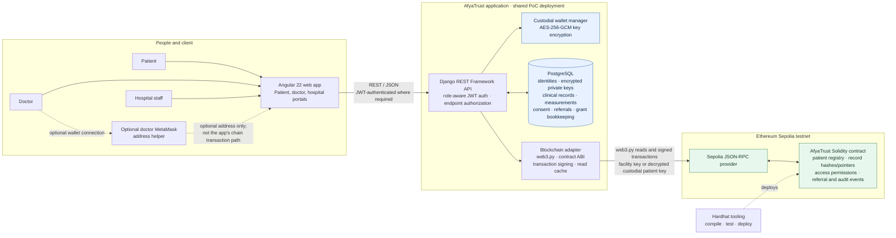

# AfyaTrust technical architecture

## Component and trust-boundary diagram



## Cross-hospital patient journey

One patient keeps the same Health ID when moving between facilities. Hospital A
and Hospital B are separate facility identities in this PoC, but both use the
same AfyaTrust API and database.

```mermaid
sequenceDiagram
    autonumber
    actor Patient
    participant A as Hospital A doctor
    participant UI as Angular app
    participant API as Django API
    participant DB as Shared PostgreSQL
    participant Chain as AfyaTrust contract on Sepolia
    participant B as Hospital B staff/doctor

    Patient->>A: Visit and provide Health ID
    A->>UI: Record diagnosis and initial clinical data
    UI->>API: Submit data for this Health ID
    API->>DB: Save off-chain clinical record
    API->>Chain: Anchor record hash and Hospital A facility ID
    Chain-->>API: Transaction receipt
    API-->>UI: Save status and verification details

    A->>UI: Refer patient to Hospital B
    UI->>API: Create referral for the same Health ID
    API->>DB: Store referral (Hospital A → Hospital B)
    Patient->>B: Visit with referral and same Health ID
    B->>UI: Accept referral
    UI->>API: Respond to referral
    API->>DB: Mark referral accepted
    API->>Chain: Log transfer of care

    B->>UI: Request source-record verification
    UI->>API: Verify accepted referral
    API->>DB: Load Hospital A records up to referral time
    API->>Chain: Read patient's record anchors
    Chain-->>API: Anchored hashes and facility IDs
    API->>API: Recompute payload hashes and compare anchors
    API-->>UI: Return verified records; withhold mismatches
    UI-->>B: Show verified initial data for continued care
```

**Current implementation boundary:** diagnoses and other clinical entries
stored as `MedicalRecord` are included in the receiving hospital's referral
verification. Vitals stored separately as `Measurement` are hash-anchored and
available through measurement history, but are **not currently included** in
the referral-verification response. If Hospital B must receive those initial
measurements as part of the handoff, that is a required follow-up to the
verification endpoint.

## Data placement and request flows

- **Clinical content stays off-chain.** `MedicalRecord.record_data` and
  measurement details are stored in PostgreSQL. The API computes a SHA-256
  digest for clinical records and measurements and anchors it with the
  facility identifier and metadata URI in the contract. The metadata endpoint
  exposes verification metadata, not the clinical payload.
- **Access is checked before records are returned.** A doctor request is
  authenticated and role-checked by Django. The API checks the contract's
  `hasAccess` permission, retrieves the patient's record anchors, and releases
  only off-chain records whose payload hash and facility match an anchor.
  Record-view audit transactions are submitted asynchronously.
- **Patient consent uses custodial signing.** The backend stores each
  patient's encrypted private key and IV in PostgreSQL. For a grant or revoke,
  it decrypts the key for the operation; the facility wallet can fund the
  patient's wallet for gas. Raw keys are not stored in the database.
- **Referral handoff is integrity-gated.** The same patient Health ID ties
  together visits at both facilities. Acceptance is stored in the
  application database and submitted as a chain event. The receiving facility
  gets record content only after the API confirms both the recomputed payload
  hash and the matching on-chain hash/facility pair. The current verification
  endpoint covers `MedicalRecord` entries, not separate `Measurement` rows.
- **Unavailable-chain behavior is explicit.** Some writes, such as
  measurements, can remain saved off-chain with a pending/unverified status.
  A database save by itself does not mean a record is blockchain-verified;
  verification-dependent reads withhold content when the chain cannot be
  checked.

## Deployment scope

The current PoC uses one Django API and one PostgreSQL database shared by its
facility identities; Hospital A and Hospital B are not separate deployments.
The frontend is an Angular single-page application. Sepolia is the configured
PoC chain, while Hardhat provides local contract development, testing, and
deployment tooling. This diagram describes repository implementation, not a
production hosting topology.
